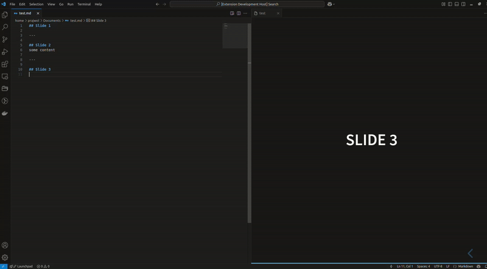

# Reveal.js Live Preview Extension

This VSCode extension allows you to preview Reveal.js slides from a Markdown file. It enables users to see slide updates in real time within VS Code as they edit Markdown files.

## Features
- **Live Preview:** Instantly renders Markdown slides with Reveal.js in a webview.
- **Theme selection:** Supports different Reveal.js theme
- **Automatic updates:** Detects and reloads changes to Markdown file.
- **Custom Reveal.js settings:** Configurable through VS Code settings.

## Using the Extension
Search `Reveal.js Live Preview` in the VS Code Extension Marketplace and install it. Once you have installed the **Reveal.js Live Preview** extension in VS Code, follow these steps to preview your slides:

### Step 1: Open your markdown file
- Open VS Code
- Open the `.md` file containing your Reveal.js slide.

### Step 2: Start the Reveal.js Live Preview
Use any of the following methods to start the preview.

#### Option 1: Use Command Palette
1. Press `Ctrl + Shift + P`.
2. Type `Revesl.js Live Preview: Start`
3. Select the command and press **Enter**

#### Option 2: Use Keyboard Shortcut
- Press `Ctrl + Alt + R`

## Customizing Reveal.js Settings
You can customize the **Reveal.js settings** (like themes, transistiions, slide separators, etc.) using the VS Code settings.

1. Open VS Code Settings `Ctrl + ,`.
2. Search for `Reveal.js Live Preview`.
3. All settings will be available and settings can be updated.
